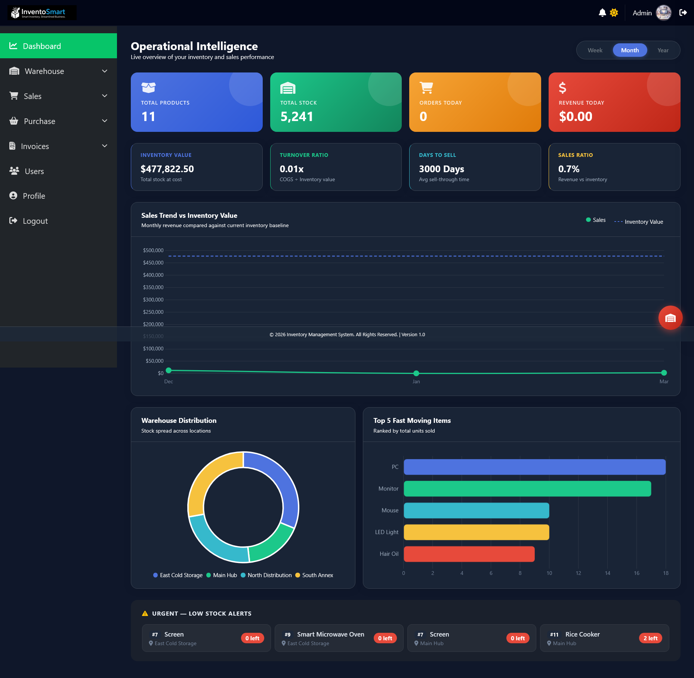
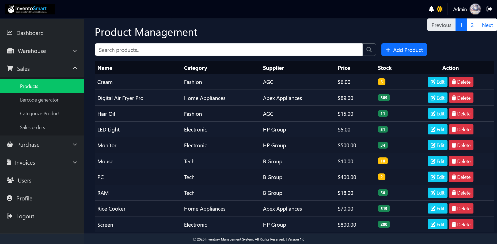
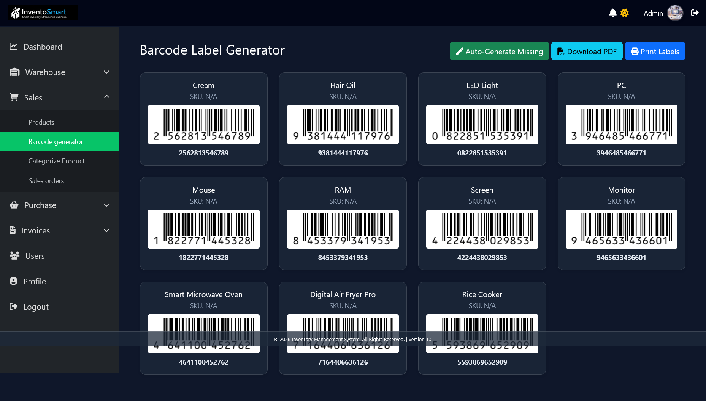
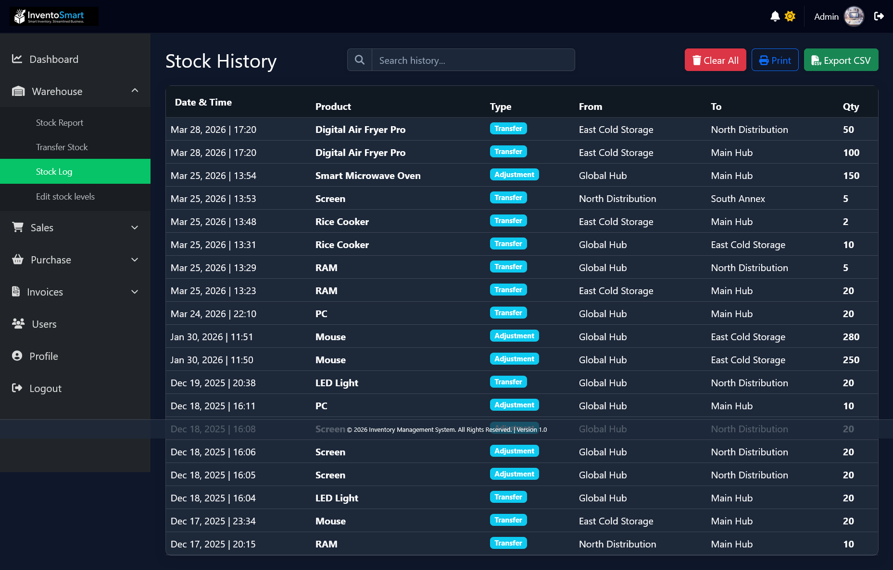
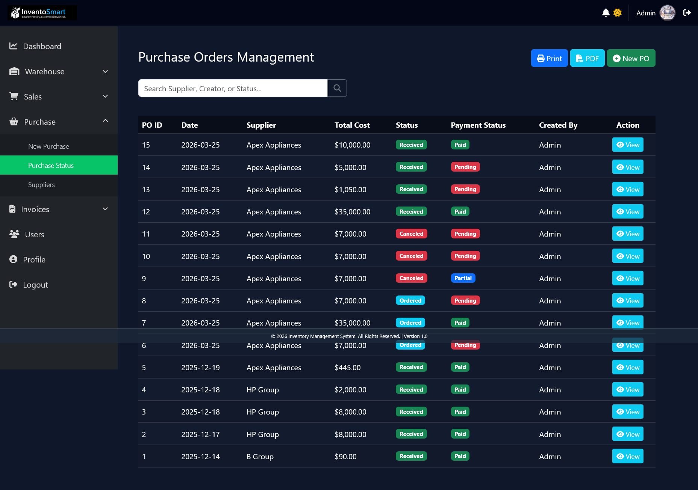

# 🏷️ InventoSmart — Smart Inventory. Streamlined Business.

> A full-featured, multi-role inventory management web application built with PHP, MySQL, JavaScript, and Bootstrap. Runs on XAMPP localhost.


---

## 📸 Screenshots

| Landing Page | Admin Dashboard |
|---|---|
|  |  |

| Product Management | Barcode Generator |
|---|---|
|  |  |

| Stock History | Purchase Orders |
|---|---|
|  |  |

---

## 🗂 Overview

**InventoSmart** is a production-ready inventory management system designed for small to medium businesses. It covers the full business workflow — from supplier purchase orders and warehouse stock management through to sales invoicing — all within a clean, role-based admin interface.

The project was built as a personal QA learning environment and has undergone extensive bug fixing across 30+ files, including session handling, PDO database interactions, PHPMailer integration, and multi-role access control.

---

## ✨ Features

### 📊 Operational Dashboard
- Real-time KPI cards: Total Products, Total Stock, Orders Today, Revenue Today
- Analytics metrics: Inventory Value, Turnover Ratio, Days to Sell, Sales Ratio
- Inventory vs Sales Analysis chart (Week / Month / Year view)

### 📦 Product Management
- Full CRUD — Add, Edit, Delete products
- Category and supplier assignment
- Colour-coded stock level badges (green / orange / red)
- Product search by name

### 🏭 Warehouse Management
- Multi-hub stock transfers (Global Hub → Main Hub, East Cold Storage, North Distribution)
- Stock adjustment and transfer logging with timestamps
- Stock history with searchable log, Export CSV, and Print
- Edit stock levels directly

### 🔖 Barcode Label Generator
- Auto-generate barcodes per product
- Auto-Generate Missing barcodes in bulk
- Download PDF labels
- Print Labels directly from the browser

### 🛒 Purchase Orders
- Create and manage Purchase Orders (POs) with supplier tracking
- Status tracking: Received / Pending
- Payment status: Paid / Unpaid
- Export to PDF and Print

### 🧾 Invoicing
- **Sales Invoice Management** — create, search, bulk print, and export sales invoices
- **Purchase Invoice Management** — PO-linked purchase invoices with received status
- Bulk Print Selected and Print Page functionality

### 👥 User Management
- Multi-role authentication (Admin, Staff)
- Session-based login with Forget Password flow
- User profile editing (name, email, address)
- PHPMailer email notifications

---

## 🛠 Tech Stack

| Layer | Technology |
|---|---|
| Frontend | HTML5, CSS3, JavaScript, Bootstrap |
| Backend | PHP (PDO), PHPMailer |
| Database | MySQL |
| Environment | XAMPP (Apache + MySQL) |
| Barcode | PHP barcode generation library |

---

## 🚀 Getting Started

### Prerequisites
- [XAMPP](https://www.apachefriends.org/) installed
- PHP 7.4+
- MySQL 5.7+

### Installation

```bash
# 1. Clone the repository
git clone https://github.com/THIRAYA-git/traditional-inventory-ms

# 2. Move to XAMPP htdocs
cp -r traditional-inventory-ms/ /xampp/htdocs/

# 3. Start Apache and MySQL from the XAMPP Control Panel

# 4. Import the database
#    Open http://localhost/phpmyadmin
#    Create a new database named: inventory_ms
#    Import the file: sql/database.sql

# 5. Configure your database credentials
#    Edit: config/db.php

# 6. Open the app
#    http://localhost/traditional-inventory-ms/index.php
```

### Default Login
| Role | Email | Password |
|---|---|---|
| Admin | admin@gmail.com | admin123 |

---

## 📁 Project Structure

```
traditional-inventory-ms/
├── admin/                          # All admin panel pages (dashboard, products, invoices, etc.)
├── employee/                       # Staff/employee role views
├── core/                           # Core logic and helpers
├── includes/                       # Shared components (header, footer, nav)
├── images/                         # Static assets and images
├── PHPMailer/                      # PHPMailer library for email notifications
├── forgot_password.php             # Password recovery flow
├── generate_hash.php               # Password hashing utility
├── hash_generator.php              # Hash generation helper
└── README.md
```

---

## 🧪 QA Notes

This project serves as a hands-on QA learning environment. The following testing has been performed:

- ✅ Multi-role session management and access control
- ✅ CRUD operations with edge case validation
- ✅ Stock transfer logic across multiple warehouse hubs
- ✅ Barcode generation and PDF export
- ✅ Invoice creation, search, and bulk print
- ✅ PHPMailer email flow
- ✅ Bug fixes across 30+ files (PDO, Bootstrap, session handling)

> Automated test suite (Playwright / PHPUnit) planned for a future phase.

---

## 🔄 Roadmap

- [x] Multi-role authentication
- [x] Product CRUD with category & supplier management
- [x] Barcode label generation & PDF export
- [x] Multi-hub warehouse stock transfers
- [x] Purchase order management
- [x] Sales & purchase invoice management
- [x] Operational Intelligence dashboard
- [ ] Automated E2E test suite
- [ ] Dashboard PDF report export
- [ ] REST API layer
- [ ] Mobile responsive improvements

---

## 👩‍💻 Author

**R. Fathima Thiraya**  
Final-year BSc Management Information Technology — South Eastern University of Sri Lanka

[](https://www.linkedin.com/in/fathima-thiraya)
[](https://github.com/THIRAYA-git)
